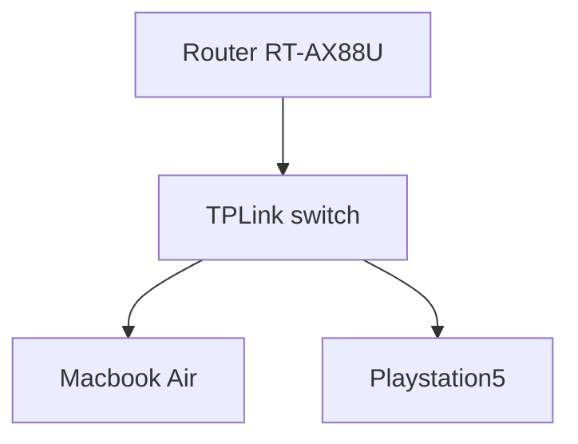

# Gran Turismo 7 Pan America Mac Script!

## Prerequisites

 - Macbook/iMac (tested on Macbook Air, Mid 2013, i5 1,3Ghz, 4GB DDR3 with macOS Big Sur v11.6.2)
 - [Hammerspoon](https://www.hammerspoon.org/)
 - [RemotePlay](https://www.playstation.com/pl-pl/remote-play/) (tested on PS5)
 - Stable Wifi/LAN (tested on LAN setting)

## Lets get started

 1. Download Hammerspoon, put them to Apps.
 2. Download&Install RemotePlay, sign in
 3. Open Hammerspoon > Open Config > choose **GT7_PS5_CZB_script.lua**
 4. Go to RemotePlay > Open GT7 > go to Controller Settings and change D-PAD like:
    >UP: Accelerate'
    >DOWN: Nitro
    >LEFT/RIGHT: Steering
 5. Now Enter World Circuits and wait till menu loads.
 6. When menu appears execute Hammerspoon Script by pressing **CTRL+S**

### How to turn off script?

I dont implemented exit feature so for now you have to stop Hammerspoon by Task Manager

### Limitations

 - Stable connection is a must! Mine connection looks like this: 

- Macbook Air and Playstation 5 has wired connection. Wifi disabled. In that cases you are not worry about RemotePlay disconnection so your script can work and you will be not worried about connection issues. Of course scripts its working on WiFi also but sometimes gets lags if you want to use all day I suggest LAN connection.
- This is not 24h script because I dont implemented daily rewards case. So you have to restart script every midnight (you can change timezone, for example I moved time +2hr so I restart script at 22:00

### How much script will earn?
Basically one loop takes ~5mins. Race about 4:10 then rest is just menu clicking\
5 mins = 35k or 52.5k (clean race)\
1hr = 420k\
24hr = 10kk at least\
100kk takes max 10 days. \:)
